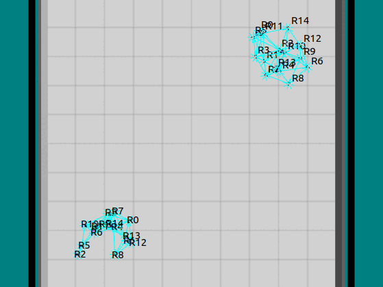

# Analytical Convergence Bounds of Distributed Intermittent Swarm Communication

**Table of Contents**
<!-- TOC -->

- [Analytical Convergence Bounds of Distributed Intermittent Swarm Communication](#analytical-convergence-bounds-of-distributed-intermittent-swarm-communication)
    - [Abstract](#abstract)
    - [Introduction](#introduction)
    - [Problem Statement](#problem-statement)
    - [Proposed Method](#proposed-method)
        - [Finding an Optimal Data Mule](#finding-an-optimal-data-mule)
        - [Using Network Curiosity](#using-network-curiosity)
        - [The Threshold Model](#the-threshold-model)
        - [Bounds on Period](#bounds-on-period)
    - [Experimentation](#experimentation)
        - [Platform and Experiment Setup](#platform-and-experiment-setup)
        - [Experiments and Expected Results](#experiments-and-expected-results)
            - [Prediction](#prediction)
            - [Meeting in the middle](#meeting-in-the-middle)
            - [Bridges](#bridges)
    - [Results](#results)
        - [What happens when 2 agents meet in the middle of the route?](#what-happens-when-2-agents-meet-in-the-middle-of-the-route)
        - [How do the values of $\alpha$ and $\beta$ affect the system?](#how-do-the-values-of-%5Calpha-and-%5Cbeta-affect-the-system)
        - [What happens when $\alpha$ is too small and $\beta$ is too big?](#what-happens-when-%5Calpha-is-too-small-and-%5Cbeta-is-too-big)
    - [References](#references)
    - [Designer Details](#designer-details)
    - [License](#license)

<!-- /TOC -->

## Abstract

**In this project, we propose a deterministic threshold model for facilitating distributed intermittent swarm communication. In our framework, each agent decides autonomously whether it will become a data mule, without a need for explicit network consensus. Unlike existing approaches, this deterministic model allows each agent to independently evaluate lower bounds on the communication frequency, which can be used in decision-making processes. The newly devised threshold model guarantees that the optimal agent is selected to be a data mule concerning a user-defined multi-objective function and that the disjointed networks are connected infinitely often, over infinite time. To demonstrate the optimally and versatility of the approach, the algorithm is tested on multiple swarm configurations with varying degrees of connectivity and packet frequency in the ARGoS simulation environment.**

## Introduction

Intermittently communicative networks of robot swarms arise when there is no constant communication between all agents. For example, situations like this may occur when the network breaks into spatially sparse clusters. Traditional methods of ensuring communication over intermittently communicative networks find laws that govern robot movement so that the entire network is connected infinitely often over infinite time. Agents that are removed from connected networks are connected infinitely back to the network given time. This is useful in any swarms of agents where network breaking is desired. This could be for exploration, mining, transportation, or any system where robots are sparsely distributed. One of the most common ways of doing this is task allocation which means deciding on ‘data mules’ to carry data back and forth. The threshold model for data mules in wireless sensor networks is based on the idea that a data mule should only visit a sensor node when the number of data packets generated by the node exceeds a certain threshold. This threshold is commonly set as a ‘maximum packet count’ that a sensor node can store before it becomes overloaded and unable to receive new data. Several papers propose the threshold model for data mules in sensor networks, and the fixed threshold value is commonly determined based on the expected number of packets generated by the nodes. The data mule visits only those nodes whose packet count exceeds the threshold. This is a limiting strategy.

The decision on which data mule to send to collect data from a particular sensor node can be made using a consensus algorithm in wireless sensor networks that use data mules. One approach to achieving consensus on which data mule to send is to use a distributed consensus algorithm such as the consensus-based bundle algorithm (CBBA). CBBA is a decentralized algorithm that enables a group of agents to allocate tasks among themselves based on their capabilities and preferences. However, consensus algorithms take time and computational effort to be applied.

## Problem Statement
How can we create a threshold model for task allocation where the tuning of variables is intuitive, and analysis of communication rate is simple to carry out in a distributed way?

## Proposed Method

### Finding an Optimal Data Mule

If it is given that a network has to decide on a data mule, then the decision on which robot becomes a data mule becomes a multi-objective optimization problem. 

An agent in network $N_{i}$ (agent $x\in N_{i}$) should be chosen to be a data mule such that it has the least utility to the network (denoted by $\phi_{utility}$) and easiest ability to carry packets from one network to another (denoted by $\phi_{connectability}$).

Thus, the objective becomes

$$
\begin{equation}
\vec\Phi(x)=
\begin{bmatrix}
\phi_{utility}(x)\\
-\phi_{connectability}(x)\\
\end{bmatrix}
\end{equation}
$$

If we convert this to a single-objective optimization function to resolve the Pareto-optimal solutions through linear scalarization, the problem becomes

$$
\begin{equation}
    \begin{gathered}
        {arg}\min_{x \in N_i}  (\phi(x))\\
        = {arg}\min_{x \in N_i}  ([\alpha \quad \beta] \cdot \vec \Phi(x))\\
        = {arg}\min_{x \in N_i}  (\alpha \cdot \phi_{utility}(x) - \beta \cdot \phi_{connectability}(x))
    \end{gathered}
\end{equation}
$$

where $\alpha$ and $\beta$ are positive definite variables that determine the relative weights of each objective.

### Using Network Curiosity

This objective does not accurately model the desired decision-making process. The weight assigned to ***connectability*** should become dependent on the importance of the connectivity instead of staying constant. If a network does not need to communicate with another network with a high frequency,  $\phi_{connectability}$ should be weighted less.

To resolve this, we introduce the idea of ***curiosity*** ($\gamma_{i}$) of network $N_{i}$. This is a measure of the time since a network $N_{i}$ has gotten or sent data mules to or from a target network, $N_{f}$. Curiosity is a time-varying parameter that grows at a determined rate from the time a mule is sent or received. The rate is linear for this work and is homogeneous across a network. If the network needs to send a mule while a low importance is placed on communication frequency (the curiosity is low) it would be preferable to send a data mule with the lowest utility to the network, however, if the importance is high, it would be preferable to send an agent which has a low cost of ***connectability***. By this, $\Phi$ becomes

$$
\begin{equation}
    \vec \Phi(x) =
    \begin{bmatrix}\phi_{{utility}}(x) \\ -\gamma_i \cdot\phi_{{connectability}}(x) \end{bmatrix}
\end{equation}
$$

and the objective becomes

$$
\begin{equation}
    \phi(x) = (\alpha \cdot \phi_{{utility}}(x) - \beta \cdot \gamma_i \cdot \phi_{{connectability}}(x))
\end{equation}
$$

In this new function, low values of $\gamma$ mean that ***connectability*** is weighted less.

### The Threshold Model

This is assuming that the network can come to a decision on when a data mule needs to be sent in a distributed manner easily, and then find the optimal agent to be a mule. To solve both problems a threshold model is adopted.

Assumptions are made about $\alpha$, $\beta$, $\phi_{utility}$, $\gamma_{i}$ and $\phi_{connectivity}$. $\alpha$ and $\beta$ are positive constants, $\gamma_{i}$ is positive semi-definite and increasing, $\phi_{utility}$ is positive definite and quasi-static, and $\phi_{connectivity}$ is  positive-semi-definite and also quasi-static.

Given these assumptions,

$$
\begin{equation}
    \dot\phi(x) = \frac{d}{dt}(\alpha \cdot \phi_{utility}(x) - \beta \cdot \gamma_i \cdot \phi_{connectability}(x)) = -\dot \gamma
\end{equation}
$$

The objective function becomes decreasing at the same rate as $\gamma$ and is definitively positive when $\gamma_{i} = 0$.

The variables can be tuned to decide when to send a data mule. The threshold of the network can be when

$$
\begin{equation}
    \min_{x \in N_i}  (\phi(x)) \leq 0
\end{equation}
$$

In this case, the agent that becomes a data mule would be

$$
\begin{equation}
    x^* = {arg}\min_{x \in N_i}  (\phi(x))
\end{equation}
$$

This formulation of the optimization algorithm can be solved easily by the distributed system, as the problem can be solved by a simple algorithm.

**Algorithm 1** AgentX()

<ul style="list-style: none;">
  <li> <b>while</b> true <b>do</b> 
  <ul style="list-style: none;">
    <li> updateGamma();
    <li> <b>if</b> ϕ ≤ 0 <b>then</b>
    <ul style="list-style: none;">
      <li> TASK = 1;
      <li> target network = not(current network);
      <li> broadcast(RESET SIGNAL);
    </ul>
    <li> <b>end if</b>
    <li> <b>if</b> TASK == 1 <b>then</b>
    <ul style="list-style: none;">
      <li> goToTargetNetwork();
      <li> <b>if</b> checkIfNeighborsInTargetNetwork() <b>then</b>
    <ul style="list-style: none;">
      <li> TASK = 1;
      <li> current network = target network;
    </ul>
    <li> <b>end if</b>
    </ul>
  <li> <b>else</b>
    <ul style="list-style: none;">
      <li> performOtherTask();
      <li> <b>if</b> RESET SIGNAL = received() <b>then</b>
      <ul style="list-style: none;">
        <li> γ = 0;
        <li> broadcast(RESET SIGNAL);
      </ul>
      <li> <b>end if</b>
    </ul>
    <li> <b>end if</b>
  </ul>
  <li> <b>end while</b>
</ul>

Here, the ***reset signal*** broadcast is easy to implement, even on a platform with a low frequency of communication between neighbors, and ensures that no other agents will choose a data mule task for a certain period.

### Bounds on Period

Since the threshold itself is simple to calculate, a bound on the period of data mule expulsion from the network can be calculated by each agent.

$\phi(x_{j})$ for agent $j$ is $0$ at

$$
\begin{equation}
    \gamma_{ij} = \frac{\alpha \cdot \phi_{utility}(x_{j})}{\beta \cdot \phi_{connectability}(x_{j})}
\end{equation}
$$

where $\gamma_{ij}$ is the curiosity value at which agent ${j}$ decides would change tasks to become a data mule. Since there is a linear relationship between  $\gamma_{ij}$ and time, this is closely related to the period, and the maximum value of  $\gamma_{ij}$ in a network will give the maximum period.

If the bounds on $\phi_{connectability}(x \in N_{i})$ and $\phi_{utility}(x \in N_{i})$ were known, or approximations could be accurately and easily made, then the bounds on the period of the system could also be known.

$$
\begin{equation}
    \begin{gathered}
        {max}(\gamma_{ij}) = \frac{\alpha}{\beta} \cdot \frac{\max(\phi_{{utility}}(x))}{{min}(\phi_{{connectability}}(x))}\\
        {min}(\gamma_{ij}) = \frac{\alpha}{\beta} \cdot \frac{\min(\phi_{{utility}}(x))}{{max}(\phi_{{connectability}}(x))}
    \end{gathered}
\end{equation}
$$

Which can be used in analyzing and making decisions on the network.

## Experimentation

### Platform and Experiment Setup

*Fig. 1: Experiment Setup in ArGoS Simulator*

We plan to simulate 2 disconnected networks with 15 agents each in ARGoS. These agents will be Khepera robots, with their connectivity radius throttled. By assigning data mules, each network will try and establish temporal connectivity and carry packets between them.

For our implementation, $\phi_{utility}$ is set as the flow of the agent in its network. By this formulation, it is guaranteed to be positive definite, and robots with a greater contribution to flow in the network are exempted from being used as data mules.

In this framework, the robots are assumed to be able to calculate flow in a decentralized manner as a heuristic for a robot's importance in a network. Since the calculation of flow is beyond the scope of this work, we have simplified the experimental implementation by using a centralized calculation of the flow in each network, which is then injected into the robots through Buzz loop code.

$\phi_{connectability}$ is calculated as the distance from an agent to the approximated centroid of the other network. Assumptions are made about the location of the target network location, thus, in our implementation, we supply each network centroid a-priori, and the task of the working (non-data carrying) robots is to rotate around their network centroid in an ellipse. This is a rotating ellipse, so the distance of each agent from the other network, as well as their flow, fluctuates. 

In our implementation, agent 0  of each network is designated as a ***network leader*** that does not carry out this algorithm. They carry out the default task and broadcast the network ID such that agents understand which network they are a part of. This network ID is cascaded through the network. When a data mule gets a message from a network leader of the target network, they become a part of the network and switch tasks.

The max and min of $\phi_{utility}$ are approximated using empirical evidence as 40 and 1. These are bounds that are overcompensated. The max and min of $\phi_{connectability}$ are found using the distances of the extrema of the ellipse. 

### Experiments and Expected Results

#### Prediction

By running this experiment multiple times with different parameters, can we predict the average rate of expulsion, and is the deviation from the rate high?
If we predict the bounds of the packet transfer rate in a decentralized manner, do we find that we are within bounds?

#### Meeting in the middle

What happens if two agents meet in the middle? We predict that they will exchange packets and go back to their respective networks quickly, as their ***utility*** would be low.

#### Bridges

If the rate is fast enough, will the agents form a bridge? 

## Results

### What happens when 2 agents meet in the middle of the route?

The agents do not form their own network, as only the agent leaders in the experiment send messages. The updated hypothesis is that dynamic network creation, such that if two agents meet in the middle they can create a new network, will influence this behavior.

### How do the values of $\alpha$ and $\beta$ affect the system?

The ratio of $\frac{\alpha}{\beta}$ determines the connectivity and the number of agents working as data mules at a given time.

*Fig. 2: Agents acting as data mules*

- A smaller value of the ratio results in agents focusing more on transmitting data and acting as a data mule as the connectability is weighted more in these instances.
- A Larger value of the ratio results in more agents focusing on their task.

*Animation. 1: $\frac{\alpha}{\beta}=0.411$*

*Fig. 4: $\frac{\alpha}{\beta}=0.538$*

Figures 3 and 4 show the trend for the value of phi over time for the leaders of each network. The stars indicate where agents are expelled from the network. In the experiment with the lower ratio, more stars are present, showing a higher frequency.

Five experiments were run over 7000 steps. At each experiment value, the approximated minimum period seemed to be a tight approximation of the actual minimum period, while the maximum period seemed to be a significant over-approximation.

- $\frac{\alpha}{\beta} = 0.411$
  - (approximated) $\gamma_{min} =95$, $\gamma_{max} = 10148$
  - (actual) $\gamma_{min} = 114$, $\gamma_{max} = 557$
- $\frac{\alpha}{\beta} = 0.7$
  - (approximated) $\gamma_{min} =162$, $\gamma_{max} = 17284$
  - (actual) $\gamma_{min} = 224$, $\gamma_{max} = 945$

That is because the maximum approximation is for a worst-case scenario, where the robot that is chosen is the one with the most cost, which will not happen as long as at least one more agent is present in the network.

### What happens when $\alpha$ is too small and $\beta$ is too big?

The ratio of $\frac{\alpha}{\beta}$ being too small results in the formation of a near bridge between the two networks. 

Since the expulsion rate is so high, agents are expelled rapidly, and end up still being connected to their network leaders by the agents that were expelled after them even over long distances. 

*Fig. 5: Bridge Formation between two networks*

*Animation. 2: Bridge Formation*

## References
- Geoffrey A Hollinger and Sanjiv Singh. Multirobot coordination with periodic connectivity: Theory and experiments. IEEE Transactions on Robotics, 28(4):967–973, 2012.
- Yiannis Kantaros, Meng Guo, and Michael M. Zavlanos. Temporal task planning and intermittent communication control of mobile robot networks. ArXiv, abs/1706.00765, 2017.
- Yiannis Kantaros and Michael M. Zavlanos. Distributed communication aware coverage control by mobile sensor networks. Automatica, 63:209– 220, 2016.
- Yiannis Kantaros and Michael M Zavlanos. Distributed intermittent connectivity control of mobile robot networks. IEEE Transactions on Automatic Control, 62(7):3109–3121, 2016.
- Miklos Mar ´ oti, Branislav Kusy, Gyula Simon, and Akos Ledeczi. The flooding time synchronization protocol. pages 39–49, 11 2004.
- Eduardo Montijano, Juan I. Montijano, and Carlos Sagues. Adaptive consensus and algebraic connectivity estimation in sensor networks with chebyshev polynomials. In 2011 50th IEEE Conference on Decision and Control and European Control Conference, pages 4296–4301, 2011.
- Danesh Tarapore, Roderich Groß, and Klaus-Peter Zauner. Sparse Robot Swarms: Moving Swarms to Real-World Applications. Frontiers in Robotics and AI, 7, 2020.

## Designer Details

- Designed for:
  - Worcester Polytechnic Institute
  - RBE595-S23-S07: Swarm Intelligence - Final Project
- Designed by:
  - [Parth Patel](mailto:parth.pmech@gmail.com)
  - [Akshay Jaitly](mailto:ajaitly@wpi.edu)
  - [Ethan Chandler](mailto:eechandler@wpi.edu)

## License

This project is licensed under [GNU General Public License v3.0](https://www.gnu.org/licenses/gpl-3.0.en.html) (see [LICENSE.md](LICENSE.md)).

Copyright 2023 Parth Patel

Licensed under the GNU General Public License, Version 3.0 (the "License"); you may not use this file except in compliance with the License.

You may obtain a copy of the License at

_https://www.gnu.org/licenses/gpl-3.0.en.html_

Unless required by applicable law or agreed to in writing, software distributed under the License is distributed on an "AS IS" BASIS, WITHOUT WARRANTIES OR CONDITIONS OF ANY KIND, either express or implied. See the License for the specific language governing permissions and limitations under the License.